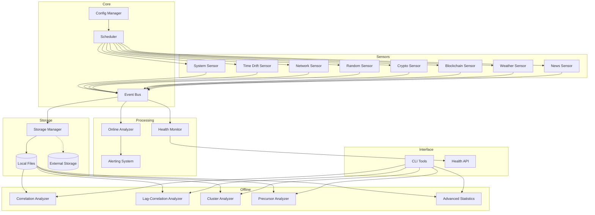

# Design Document: Matrix Watcher v1.0

## Overview

Matrix Watcher — модульная система сбора и анализа данных из множества независимых источников для поиска скрытых закономерностей и аномалий. Архитектура построена на принципах:

- **Модульность**: каждый сенсор — независимый компонент
- **Event-driven**: центральная шина событий для связи компонентов
- **Расширяемость**: легко добавлять новые сенсоры и анализаторы
- **Отказоустойчивость**: сбой одного компонента не останавливает систему

```
┌─────────────────────────────────────────────────────────────────┐
│                        Matrix Watcher                            │
├─────────────────────────────────────────────────────────────────┤
│  ┌─────────┐ ┌─────────┐ ┌─────────┐ ┌─────────┐ ┌─────────┐   │
│  │ System  │ │  Time   │ │ Network │ │ Random  │ │ Crypto  │   │
│  │ Sensor  │ │ Drift   │ │ Sensor  │ │ Sensor  │ │ Sensor  │   │
│  └────┬────┘ └────┬────┘ └────┬────┘ └────┬────┘ └────┬────┘   │
│       │           │           │           │           │         │
│  ┌────┴───────────┴───────────┴───────────┴───────────┴────┐   │
│  │                      Event Bus                           │   │
│  └────┬───────────┬───────────┬───────────┬───────────┬────┘   │
│       │           │           │           │           │         │
│  ┌────▼────┐ ┌────▼────┐ ┌────▼────┐ ┌────▼────┐ ┌────▼────┐   │
│  │ Storage │ │ Online  │ │ Health  │ │Alerting │ │Scheduler│   │
│  │ Manager │ │Analyzer │ │ Monitor │ │ System  │ │         │   │
│  └─────────┘ └─────────┘ └─────────┘ └─────────┘ └─────────┘   │
│                                                                  │
│  ┌──────────────────────────────────────────────────────────┐   │
│  │                   Offline Analyzers                       │   │
│  │  ┌────────────┐ ┌────────────┐ ┌────────────┐            │   │
│  │  │Correlation │ │ Lag-Corr   │ │  Cluster   │            │   │
│  │  │  Analyzer  │ │  Analyzer  │ │  Analyzer  │            │   │
│  │  └────────────┘ └────────────┘ └────────────┘            │   │
│  │  ┌────────────┐ ┌────────────┐                           │   │
│  │  │ Precursor  │ │ Advanced   │                           │   │
│  │  │  Analyzer  │ │ Statistics │                           │   │
│  │  └────────────┘ └────────────┘                           │   │
│  └──────────────────────────────────────────────────────────┘   │
└─────────────────────────────────────────────────────────────────┘
```

## Architecture

### High-Level Components



### Directory Structure

```
matrix-watcher/
├── config.json                 # Main configuration
├── main.py                     # Entry point
├── analyze.py                  # CLI for offline analysis
│
├── src/
│   ├── __init__.py
│   ├── config/
│   │   ├── __init__.py
│   │   ├── config_manager.py   # Configuration loading/validation
│   │   └── schema.py           # Config schema definitions
│   │
│   ├── core/
│   │   ├── __init__.py
│   │   ├── event_bus.py        # Pub/sub event distribution
│   │   ├── scheduler.py        # Task scheduling
│   │   └── types.py            # Common type definitions
│   │
│   ├── sensors/
│   │   ├── __init__.py
│   │   ├── base.py             # Abstract sensor base class
│   │   ├── system_sensor.py
│   │   ├── time_drift_sensor.py
│   │   ├── network_sensor.py
│   │   ├── random_sensor.py
│   │   ├── crypto_sensor.py
│   │   ├── blockchain_sensor.py
│   │   ├── weather_sensor.py
│   │   └── news_sensor.py
│   │
│   ├── storage/
│   │   ├── __init__.py
│   │   ├── base.py             # Storage backend interface
│   │   ├── jsonl_storage.py    # JSONL file storage
│   │   ├── parquet_export.py   # Parquet export
│   │   └── storage_manager.py  # Storage orchestration
│   │
│   ├── analyzers/
│   │   ├── __init__.py
│   │   ├── online/
│   │   │   ├── __init__.py
│   │   │   └── anomaly_detector.py
│   │   └── offline/
│   │       ├── __init__.py
│   │       ├── correlation.py
│   │       ├── lag_correlation.py
│   │       ├── cluster.py
│   │       ├── precursor.py
│   │       └── advanced.py
│   │
│   ├── monitoring/
│   │   ├── __init__.py
│   │   ├── health_monitor.py
│   │   └── alerting.py
│   │
│   └── utils/
│       ├── __init__.py
│       ├── statistics.py       # Statistical helpers
│       └── time_utils.py       # Time handling utilities
│
├── logs/                       # Data storage
│   ├── system/
│   ├── time_drift/
│   ├── network/
│   ├── random/
│   ├── crypto/
│   ├── blockchain/
│   ├── weather/
│   ├── news/
│   ├── anomalies/
│   └── all_events/
│
└── tests/
    ├── __init__.py
    ├── test_sensors/
    ├── test_storage/
    ├── test_analyzers/
    └── conftest.py
```

## Components and Interfaces

### 1. Configuration Manager

```python
@dataclass
class SensorConfig:
    enabled: bool
    interval_seconds: float
    priority: str  # "high", "medium", "low"
    custom_params: dict[str, Any]

@dataclass
class Config:
    sensors: dict[str, SensorConfig]
    storage: StorageConfig
    analysis: AnalysisConfig
    alerting: AlertingConfig
    api_keys: dict[str, str]

class ConfigManager:
    def load(self, path: str) -> Config: ...
    def validate(self, config: Config) -> list[str]: ...  # Returns validation errors
    def save_default(self, path: str) -> None: ...
    def reload(self) -> Config: ...  # Hot reload
```

### 2. Event Bus

```python
@dataclass
class Event:
    timestamp: float
    source: str
    event_type: str  # "data", "anomaly", "error", "health"
    payload: dict[str, Any]

class EventBus:
    def subscribe(self, event_type: str, callback: Callable[[Event], None]) -> str: ...
    def unsubscribe(self, subscription_id: str) -> None: ...
    def publish(self, event: Event) -> None: ...
    def get_buffer_size(self, subscriber_id: str) -> int: ...
```

### 3. Scheduler

```python
class Scheduler:
    def register_task(self, name: str, callback: Callable, interval: float, priority: str) -> None: ...
    def start(self) -> None: ...
    def stop(self) -> None: ...
    def pause_task(self, name: str) -> None: ...
    def resume_task(self, name: str) -> None: ...
    def get_stats(self) -> dict[str, TaskStats]: ...
```

### 4. Base Sensor Interface

```python
from abc import ABC, abstractmethod

@dataclass
class SensorReading:
    timestamp: float
    source: str
    data: dict[str, Any]
    metadata: dict[str, Any] | None = None

class BaseSensor(ABC):
    def __init__(self, config: SensorConfig, event_bus: EventBus): ...
    
    @abstractmethod
    async def collect(self) -> SensorReading: ...
    
    @abstractmethod
    def get_schema(self) -> dict[str, type]: ...  # Field name -> type
    
    def start(self) -> None: ...
    def stop(self) -> None: ...
    def get_status(self) -> str: ...  # "running", "stopped", "error"
```

### 5. Storage Interface

```python
from abc import ABC, abstractmethod

class StorageBackend(ABC):
    @abstractmethod
    def write(self, sensor_name: str, record: dict) -> None: ...
    
    @abstractmethod
    def read(self, sensor_name: str, start_date: date, end_date: date) -> Iterator[dict]: ...
    
    @abstractmethod
    def get_size(self, sensor_name: str) -> int: ...  # Bytes

class StorageManager:
    def __init__(self, backend: StorageBackend, config: StorageConfig): ...
    def write_record(self, event: Event) -> None: ...
    def read_records(self, sensor: str, start: date, end: date) -> pd.DataFrame: ...
    def export_parquet(self, sensor: str, start: date, end: date, output: str) -> None: ...
    def get_all_sensors(self) -> list[str]: ...
```

### 6. Online Anomaly Detector

```python
@dataclass
class AnomalyEvent:
    timestamp: float
    parameter: str
    value: float
    mean: float
    std: float
    z_score: float
    sensor_source: str

class OnlineAnomalyDetector:
    def __init__(self, config: AnalysisConfig, event_bus: EventBus): ...
    def process(self, event: Event) -> list[AnomalyEvent]: ...
    def get_window_stats(self, parameter: str) -> dict: ...
    def reset_window(self, parameter: str) -> None: ...
```

### 7. Offline Analyzers

```python
class CorrelationAnalyzer:
    def analyze(self, data: pd.DataFrame) -> CorrelationResult: ...
    def generate_heatmap(self, result: CorrelationResult, output: str) -> None: ...
    def export_csv(self, result: CorrelationResult, output: str) -> None: ...

class LagCorrelationAnalyzer:
    def analyze(self, data: pd.DataFrame, max_lag: int = 60) -> LagCorrelationResult: ...
    def find_optimal_lags(self, result: LagCorrelationResult) -> dict[tuple[str, str], int]: ...
    def generate_plots(self, result: LagCorrelationResult, output_dir: str) -> None: ...

class ClusterAnalyzer:
    def analyze(self, anomalies: pd.DataFrame, window_seconds: float = 3.0) -> ClusterResult: ...
    def build_graph(self, anomalies: pd.DataFrame) -> nx.Graph: ...
    def rank_clusters(self, result: ClusterResult) -> list[Cluster]: ...

class PrecursorAnalyzer:
    def analyze(self, data: pd.DataFrame, anomalies: pd.DataFrame) -> PrecursorResult: ...
    def find_patterns(self, windows: list[pd.DataFrame]) -> list[Pattern]: ...
    def calculate_confidence(self, pattern: Pattern) -> float: ...

class AdvancedAnalyzer:
    def mutual_information(self, data: pd.DataFrame) -> pd.DataFrame: ...
    def fft_analysis(self, series: pd.Series) -> FFTResult: ...
    def detect_periodicity(self, series: pd.Series) -> list[float]: ...  # Periods in seconds
```

## Data Models

### Sensor Data Records

```python
# System Sensor
@dataclass
class SystemRecord:
    timestamp: float
    local_time_unix: float
    loop_interval_ms: float
    loop_drift_ms: float
    cpu_usage_percent: float
    ram_usage_percent: float
    cpu_temperature: float | None
    process_pid: int
    process_uptime_seconds: float

# Time Drift Sensor
@dataclass
class TimeDriftRecord:
    timestamp: float
    local_time: float
    ntp_time: float | None
    api_time: float | None
    diff_local_ntp_ms: float | None
    diff_local_api_ms: float | None

# Network Sensor
@dataclass
class NetworkRecord:
    timestamp: float
    target_host: str
    latency_ms: float
    status_code: int
    response_size_bytes: int

# Random Sensor
@dataclass
class RandomRecord:
    timestamp: float
    source: str  # "python_random", "os_urandom", "random_org"
    sample_size: int
    zeros_count: int
    ones_count: int
    chi_square: float
    p_value: float
    raw_bits: str | None  # Optional, for detailed analysis

# Crypto Sensor
@dataclass
class CryptoRecord:
    timestamp: float
    symbol: str
    price: float
    best_bid: float
    best_ask: float
    spread: float
    volume_24h: float
    trade_id: int | None
    price_delta_percent: float

# Blockchain Sensor
@dataclass
class BlockchainRecord:
    timestamp: float
    network: str
    block_height: int
    block_hash: str
    block_time: float
    tx_count: int
    gas_used: int | None
    gas_limit: int | None
    difficulty: float | None
    block_interval_sec: float

# Weather Sensor
@dataclass
class WeatherRecord:
    timestamp: float
    location: str
    temperature_celsius: float
    humidity_percent: float
    pressure_hpa: float
    clouds_percent: float
    wind_speed_ms: float

# News Sensor
@dataclass
class NewsRecord:
    timestamp: float
    source: str
    headline: str
    headline_hash: str
    text_length: int
    word_count: int
    text_entropy: float
```

### Analysis Results

```python
@dataclass
class CorrelationResult:
    matrix: pd.DataFrame
    significant_pairs: list[tuple[str, str, float]]  # (param_a, param_b, correlation)
    timestamp: float

@dataclass
class LagCorrelationResult:
    lag_matrix: dict[tuple[str, str], list[float]]  # (param_a, param_b) -> correlations at each lag
    optimal_lags: dict[tuple[str, str], tuple[int, float]]  # (param_a, param_b) -> (lag, max_corr)
    timestamp: float

@dataclass
class Cluster:
    id: int
    anomalies: list[AnomalyEvent]
    sensors_involved: set[str]
    time_span_seconds: float
    start_time: float
    end_time: float

@dataclass
class Pattern:
    description: str
    frequency: int
    confidence: float
    example_timestamps: list[float]
```

### Configuration Schema

```python
@dataclass
class StorageConfig:
    base_path: str = "logs"
    compression: bool = False
    max_file_size_mb: int = 100
    buffer_size: int = 1000

@dataclass
class AnalysisConfig:
    window_size: int = 100
    z_score_threshold: float = 4.0
    lag_range_seconds: int = 60
    cluster_window_seconds: float = 3.0

@dataclass
class AlertingConfig:
    enabled: bool = False
    webhook_url: str | None = None
    cooldown_seconds: int = 300
    alert_on_clusters: bool = True
    alert_on_correlations: bool = True
    min_cluster_sensors: int = 3
```


## Correctness Properties

*A property is a characteristic or behavior that should hold true across all valid executions of a system-essentially, a formal statement about what the system should do. Properties serve as the bridge between human-readable specifications and machine-verifiable correctness guarantees.*

Based on the prework analysis, the following correctness properties have been identified for property-based testing:

### Configuration Properties

**Property 1: Configuration round-trip**
*For any* valid configuration object, serializing to JSON and parsing back SHALL produce an equivalent configuration object.
**Validates: Requirements 1.1**

**Property 2: Invalid configuration handling**
*For any* configuration with invalid values (wrong types, out-of-range numbers, missing required fields), the system SHALL return validation errors and use default values for invalid fields.
**Validates: Requirements 1.3**

### Sensor Data Properties

**Property 3: System sensor record completeness**
*For any* System Sensor reading, the output record SHALL contain all required fields: timestamp, local_time_unix, loop_interval_ms, loop_drift_ms, cpu_usage_percent, ram_usage_percent, process_pid, process_uptime_seconds.
**Validates: Requirements 2.2**

**Property 4: Time drift calculation correctness**
*For any* Time Drift Sensor reading with known local_time, ntp_time, and api_time values, the calculated diff_local_ntp_ms and diff_local_api_ms SHALL equal (local_time - ntp_time) * 1000 and (local_time - api_time) * 1000 respectively.
**Validates: Requirements 3.3**

**Property 5: Network sensor record completeness**
*For any* Network Sensor reading, the output record SHALL contain: timestamp, target_host, latency_ms, status_code, response_size_bytes.
**Validates: Requirements 4.3**

**Property 6: Random sensor batch size**
*For any* Random Sensor reading, the sample SHALL contain exactly 1024 random values.
**Validates: Requirements 5.3**

**Property 7: Random sensor statistics correctness**
*For any* batch of random bits, zeros_count + ones_count SHALL equal the total bit count, and chi_square SHALL be calculated as sum((observed - expected)^2 / expected).
**Validates: Requirements 5.4**

**Property 8: Non-random detection**
*For any* batch of bits with p_value < 0.01, the system SHALL flag the sample as anomalous.
**Validates: Requirements 5.6**

**Property 9: Crypto sensor record completeness**
*For any* Crypto Sensor reading, the output record SHALL contain: timestamp, symbol, price, best_bid, best_ask, spread, volume_24h, price_delta_percent.
**Validates: Requirements 6.3**

**Property 10: Crypto price delta flagging**
*For any* Crypto Sensor reading where abs(price_delta_percent) exceeds the configured threshold, the system SHALL flag the event as significant.
**Validates: Requirements 6.5**

**Property 11: Blockchain sensor record completeness**
*For any* Blockchain Sensor reading, the output record SHALL contain: timestamp, network, block_height, block_hash, block_time, tx_count, block_interval_sec.
**Validates: Requirements 7.3**

**Property 12: Block interval anomaly detection**
*For any* Blockchain Sensor reading where block_interval_sec deviates more than 50% from expected average, the system SHALL flag the block as anomalous.
**Validates: Requirements 7.5**

**Property 13: Weather sensor record completeness**
*For any* Weather Sensor reading, the output record SHALL contain: timestamp, location, temperature_celsius, humidity_percent, pressure_hpa, clouds_percent, wind_speed_ms.
**Validates: Requirements 8.2**

**Property 14: News sensor record completeness**
*For any* News Sensor reading, the output record SHALL contain: timestamp, source, headline, headline_hash, text_length, word_count, text_entropy.
**Validates: Requirements 9.2**

**Property 15: Shannon entropy calculation**
*For any* text string, the calculated text_entropy SHALL equal -sum(p * log2(p)) where p is the probability of each character.
**Validates: Requirements 9.5**

### Storage Properties

**Property 16: Storage path generation**
*For any* sensor name and date, the generated file path SHALL match the pattern `logs/{sensor_name}/{YYYY-MM-DD}.jsonl`.
**Validates: Requirements 10.1, 10.2, 10.3**

**Property 17: File rotation**
*For any* log file that exceeds 100MB, the system SHALL create a new file with incremental suffix and continue writing to the new file.
**Validates: Requirements 10.4**

**Property 18: JSONL round-trip**
*For any* valid sensor record, serializing to JSONL and parsing back SHALL produce an equivalent record.
**Validates: Requirements 10.8, 10.9**

**Property 19: Parquet export round-trip**
*For any* set of sensor records, exporting to Parquet and importing back SHALL produce equivalent records.
**Validates: Requirements 10.5**

**Property 20: Gzip compression round-trip**
*For any* JSONL file content, compressing with gzip and decompressing SHALL produce identical content.
**Validates: Requirements 10.11**

**Property 21: Record structure**
*For any* stored record, it SHALL contain timestamp (float) and source (string) fields.
**Validates: Requirements 10.7**

### Online Analyzer Properties

**Property 22: Sliding window size**
*For any* parameter with configured window size N, the sliding window SHALL contain at most N values.
**Validates: Requirements 11.1**

**Property 23: Z-score calculation**
*For any* sliding window with values, the calculated z-score SHALL equal (value - mean) / std where mean and std are computed from the window.
**Validates: Requirements 11.2**

**Property 24: Anomaly classification**
*For any* value with abs(z_score) > 4.0, the system SHALL classify it as an anomaly.
**Validates: Requirements 11.3**

**Property 25: Anomaly record completeness**
*For any* detected anomaly, the record SHALL contain: timestamp, parameter_name, value, mean, std, z_score, sensor_source.
**Validates: Requirements 11.6**

### Correlation Analyzer Properties

**Property 26: Correlation matrix symmetry**
*For any* correlation matrix, corr(A, B) SHALL equal corr(B, A) for all parameter pairs.
**Validates: Requirements 12.1**

**Property 27: Pearson correlation bounds**
*For any* calculated Pearson correlation coefficient, the value SHALL be in range [-1, 1].
**Validates: Requirements 12.2**

**Property 28: Significant correlation filtering**
*For any* correlation matrix, all pairs in significant_pairs list SHALL have abs(correlation) > 0.7.
**Validates: Requirements 12.4**

### Lag-Correlation Analyzer Properties

**Property 29: Lag range coverage**
*For any* lag-correlation analysis, the system SHALL test all integer lags from -60 to +60 seconds.
**Validates: Requirements 13.1**

**Property 30: Optimal lag selection**
*For any* parameter pair, the optimal_lag SHALL correspond to the lag with maximum absolute correlation.
**Validates: Requirements 13.2**

**Property 31: Lag-correlation record completeness**
*For any* lag-correlation result, it SHALL contain: parameter_a, parameter_b, optimal_lag_seconds, max_correlation.
**Validates: Requirements 13.3**

**Property 32: Causal relationship flagging**
*For any* parameter pair where optimal_lag differs significantly from zero (abs > 5 seconds), the system SHALL flag it as potential causal relationship.
**Validates: Requirements 13.4**

### Cluster Analyzer Properties

**Property 33: Temporal clustering**
*For any* two anomalies occurring within ±3 seconds, they SHALL be connected in the anomaly graph.
**Validates: Requirements 14.1**

**Property 34: Graph construction**
*For any* set of anomalies, the graph SHALL have one node per anomaly and edges only between temporally proximate anomalies.
**Validates: Requirements 14.2**

**Property 35: Cluster identification**
*For any* anomaly graph, each connected component SHALL be identified as a separate cluster.
**Validates: Requirements 14.3**

**Property 36: Cluster ranking**
*For any* set of clusters, they SHALL be ranked by: (1) number of distinct sensors, (2) total anomaly count, (3) time span.
**Validates: Requirements 14.4**

**Property 37: Multi-source cluster flagging**
*For any* cluster involving 3 or more distinct sensors, the system SHALL flag it as significant.
**Validates: Requirements 14.5**

### Precursor Analyzer Properties

**Property 38: Pre-anomaly window extraction**
*For any* anomaly, the system SHALL extract data windows at exactly 5, 10, and 30 seconds before the anomaly timestamp.
**Validates: Requirements 15.1**

**Property 39: Pattern frequency calculation**
*For any* identified pattern, the frequency SHALL equal the count of anomalies preceded by that pattern.
**Validates: Requirements 15.3**

**Property 40: Precursor threshold**
*For any* pattern appearing before more than 30% of anomalies of the same type, the system SHALL flag it as potential precursor.
**Validates: Requirements 15.4**

### Advanced Analyzer Properties

**Property 41: Mutual information non-negativity**
*For any* parameter pair, the calculated mutual information SHALL be >= 0.
**Validates: Requirements 16.1**

**Property 42: FFT frequency detection**
*For any* signal with known periodic component, the FFT analysis SHALL detect the corresponding frequency peak.
**Validates: Requirements 16.2**

**Property 43: Periodicity flagging**
*For any* detected periodic pattern with period less than 86400 seconds (24 hours), the system SHALL flag it as significant.
**Validates: Requirements 16.4**

### Event Bus Properties

**Property 44: Event delivery**
*For any* published event, all subscribers to that event type SHALL receive the event.
**Validates: Requirements 17.1, 17.2**

**Property 45: Buffer overflow handling**
*For any* subscriber buffer exceeding 1000 events, the oldest events SHALL be dropped first.
**Validates: Requirements 17.3, 17.4**

**Property 46: Event filtering**
*For any* subscriber with filter criteria, only events matching the criteria SHALL be delivered.
**Validates: Requirements 17.5**

### Scheduler Properties

**Property 47: No execution overlap**
*For any* sensor, there SHALL be no overlapping executions of the same sensor.
**Validates: Requirements 18.2**

**Property 48: Priority ordering**
*For any* set of pending tasks, high-priority tasks SHALL be executed before low-priority tasks when resources are constrained.
**Validates: Requirements 18.3**

### Health Monitor Properties

**Property 49: Sensor status tracking**
*For any* sensor, the Health Monitor SHALL track its current status (running, stopped, error, rate-limited).
**Validates: Requirements 19.1**

**Property 50: Consecutive failure handling**
*For any* sensor that fails 3 consecutive times, the system SHALL disable the sensor and trigger an alert.
**Validates: Requirements 19.4**

### Alerting Properties

**Property 51: Cooldown enforcement**
*For any* alert type, duplicate alerts SHALL be suppressed during the configured cooldown period.
**Validates: Requirements 21.4**

### Export/Replay Properties

**Property 52: CSV export round-trip**
*For any* set of records, exporting to CSV and importing back SHALL preserve all numeric values and timestamps.
**Validates: Requirements 22.5**

## Error Handling

### Sensor Errors

| Error Type | Handling Strategy |
|------------|-------------------|
| API timeout | Retry with exponential backoff (1s, 2s, 4s, max 30s) |
| API rate limit | Pause sensor, wait for reset, resume |
| Network unreachable | Record null values, continue with other sensors |
| Invalid response | Log error, skip record, continue |
| Authentication failure | Disable sensor, alert operator |

### Storage Errors

| Error Type | Handling Strategy |
|------------|-------------------|
| Disk full | Alert operator, pause non-critical sensors |
| Write failure | Buffer in memory (max 10000 records), retry |
| Corrupted file | Rotate to new file, log corruption |
| Permission denied | Alert operator, attempt alternative path |

### Analysis Errors

| Error Type | Handling Strategy |
|------------|-------------------|
| Insufficient data | Skip analysis, log warning |
| Numerical overflow | Use robust statistics (median, MAD) |
| Memory exhaustion | Process in chunks, reduce window size |

## Testing Strategy

### Property-Based Testing

The project will use **Hypothesis** library for property-based testing in Python.

Each property-based test will:
- Run a minimum of 100 iterations
- Be tagged with a comment referencing the correctness property: `# Feature: matrix-watcher, Property {number}: {property_text}`
- Generate random inputs using smart generators that constrain to valid input space

### Unit Tests

Unit tests will cover:
- Specific examples demonstrating correct behavior
- Edge cases (empty inputs, boundary values)
- Error conditions and exception handling
- Integration points between components

### Test Organization

```
tests/
├── conftest.py                 # Shared fixtures and generators
├── test_config/
│   ├── test_config_manager.py  # Unit tests
│   └── test_config_properties.py  # Property tests (Props 1-2)
├── test_sensors/
│   ├── test_system_sensor.py
│   ├── test_time_drift_sensor.py
│   ├── test_network_sensor.py
│   ├── test_random_sensor.py
│   ├── test_crypto_sensor.py
│   ├── test_blockchain_sensor.py
│   ├── test_weather_sensor.py
│   ├── test_news_sensor.py
│   └── test_sensor_properties.py  # Property tests (Props 3-15)
├── test_storage/
│   ├── test_jsonl_storage.py
│   ├── test_parquet_export.py
│   └── test_storage_properties.py  # Property tests (Props 16-21)
├── test_analyzers/
│   ├── test_online/
│   │   ├── test_anomaly_detector.py
│   │   └── test_anomaly_properties.py  # Property tests (Props 22-25)
│   └── test_offline/
│       ├── test_correlation.py
│       ├── test_lag_correlation.py
│       ├── test_cluster.py
│       ├── test_precursor.py
│       ├── test_advanced.py
│       └── test_analyzer_properties.py  # Property tests (Props 26-43)
├── test_core/
│   ├── test_event_bus.py
│   ├── test_scheduler.py
│   └── test_core_properties.py  # Property tests (Props 44-48)
└── test_monitoring/
    ├── test_health_monitor.py
    ├── test_alerting.py
    └── test_monitoring_properties.py  # Property tests (Props 49-52)
```

### Generators for Property Tests

```python
# Example generators for Hypothesis
from hypothesis import strategies as st

# Configuration generators
valid_interval = st.floats(min_value=0.1, max_value=3600.0)
valid_priority = st.sampled_from(["high", "medium", "low"])
sensor_config = st.builds(SensorConfig, enabled=st.booleans(), interval_seconds=valid_interval, priority=valid_priority)

# Sensor data generators
timestamp = st.floats(min_value=0, max_value=2**31)
cpu_percent = st.floats(min_value=0, max_value=100)
latency_ms = st.floats(min_value=0, max_value=10000)
price = st.floats(min_value=0.0001, max_value=1000000)

# Random bits generator
random_bits = st.binary(min_size=128, max_size=128)  # 1024 bits

# Anomaly generators
z_score = st.floats(min_value=-10, max_value=10)
anomaly_timestamp = st.floats(min_value=0, max_value=2**31)
```
